# 区块链课程 -- 前期热身报告

## 姓名：陈明亮

## 学号：16340023


### 一、Ubuntu系统下安装以太坊

1. 首先需要拥有存储空间充足，内存空间2~4GB的Ubuntu主机(或虚拟机)，使用终端工具`apt`安装以下各项依赖包，最终完成目标应用`ethereum`的安装完成即可。

2. 打开Ubuntu系统下终端，依次输入以下安装命令：

   ```bash
   sudo apt-get update
   sudo sudo apt-get install software-properties-common
   sudo add-apt-repository -y ppa:ethereum/ethereum  #添加相应ppa脚本到当前安装库中，自动导出公钥
   sudo add-apt-repository -y ppa:ethereum/ethereum-dev
   sudo apt-get update
   sudo apt-get install ethereum  #完成以太坊geth客户端的安装
   ```

3. 安装完成之后，请在终端下输入命令`geth -h`，若能够成功打印帮助信息，说明安装成功，否则是可能缺少某些依赖库，如`nodejs`等，具体请参照错误信息，或者参考他人的博客即可。


### 二、私有链创世区块的搭建

1. 为创建创世区块，我们需要定义区块的初始`json`文件，使用`geth`客户端提供的`init`操作进行私有链的创世区块的初始化。以下提供`genesis.json`参考模板：

   ```json
   {
       "config": {
         "chainId": 15,
         "homesteadBlock": 0,
         "eip155Block": 0,
         "eip158Block": 0
     },
     "alloc": {
       "bc409ece02d7cb31cf63dfdfc48db0b82770d014": {
         "balance": "0000000000000000000000000000000"
       }
     },

     "nonce": "0x0000000000000056",
     "difficulty": "0x1",
     "mixhash": "0x0000000000000000000000000000000000000000000000000000000000000000",
     "coinbase": "0x0000000000000000000000000000000000000000",
     "timestamp": "0x00",
     "parentHash": "0x0000000000000000000000000000000000000000000000000000000000000000",
     "extraData": "0x11bbe8db4e347b4e8c937c1c8370e4b5ed33adb3db69cbdb7a38e1e50b1b82fa",
     "gasLimit": "0x4c4b40"

   }
   ```

   分析：

   * 此处的关键在于`alloc`字段的设置，在自己进行创世区块的初始化`json`编写时，需要把用户对应的公钥哈希更改为你自己新增的用户，新建用户命令: `eth.newAccount("Your password")`。
   * `config`字段内部记录了私链id等信息，`alloc`用于存储已创建的用户名与初始存款信息，方便后续的挖矿、记录挖出以太币数量的工作。`nonce`是一个64位的随机数，用于在挖矿的过程中与`mixhash`共同参与工作，并在`POW`过程中用于验证区块有效性、特异性的数值。`difficulty`设置当前区块的难度，难度过大会导致挖矿时间持续增长。
   * `coinbase`设置初始矿工账号，可以不填。`timestamp`设置创世块的时间戳，`gaslimit`设置私有链所有区块对`gas`消耗总量的限制。

   ​

2. 使用`genesis.json`配置私有链

   首先在当前json文件目录下打开终端，输入以下命令：

   ```bash
   geth --datadir eth --networkid 2018111 --nodiscover --rpc --rpccorsdomain "*" init ./genesis.json console
   ```

   分析：参数`-datadir`设置的是私有链信息存储的文件夹，应当按照自己的实际情况修改目标文件夹名称。`-network`后接私链id，注意如果将私链id设置为1，则默认接入以太坊公有链，应当谨慎设置。`-nodiscover`设置该链为不可发现其他节点，更不会主动链接其他节点的状态

   结果：(最终显示成功写入初始状态即为配置完成)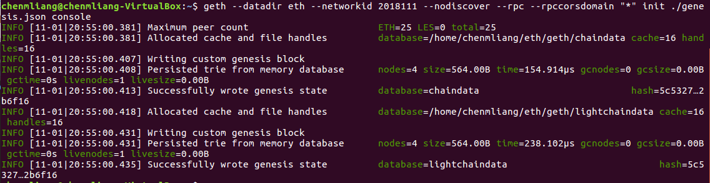


3. 启用私有链节点

   ```bash
   geth --identity "Test" --rpc --rpcport "8333" --datadir eth --port "30304" --nodiscover console 
   ```

   分析：利用参数`-identity`标识该私有链中的节点，同时指定`rpcport`与`port`，前者指定`http-rpc`连接端口号，后者指定该节点与本节点连接使用的端口号。其余的参数基本上与上文命令功能相同，此处不做赘述。

   ​

### 三、解释getBlock()方法结果字段

1. 使用`geth`进行挖矿工作

   * 首先打开`geth`客户端，为了避免进行时总是要输入命令，可以手写bash文件进行命令记录，方便每一次的打开。

     ```bash
     geth --datadir eth --networkid 2018111 --rpc --rpcorsdomain --nodiscover cnosole
     ```

   * 需要申请新的矿工账户，使用`personal.newAccount("Your password")`进行账户注册登录，也可以直接`personal.unlockAccount(eth.accounts[index], "Password")`指定登录之前申请过的账户，注意index为你要登陆的账户在`eth`总账户表内的下标，对应地填入其password即可。

   * 查看当前矿工的`coinbase`，如果显示正确信息，即可以马上开始挖矿：

     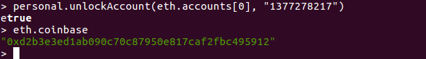

     ```bash
     > eth.coinbase
     > miner.start()
     ```

     挖矿操作起始过程：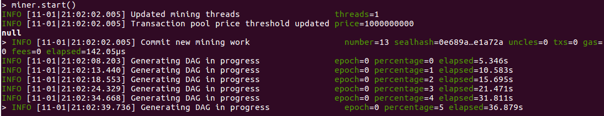

     分析：之前已经进行了一次挖矿操作，所以本次挖矿操作起始的`Commit mining work`建立在区块`number=13`之上。`Generating DAG in Progress`可以理解为挖矿的求解难题过程，右边的`percentage`为进度，当进度到达100之时则解题完成，一般情况下都会挖到矿，获得相应的奖励。

     挖矿完成过程：

     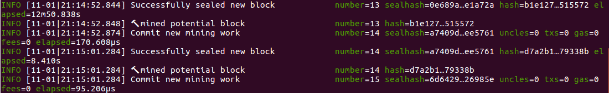

     分析：该部分图说明了挖矿成功的情形，可以看到右边的区块数逐渐增加。

     ​

2. 查看最新区块的`Block`信息

   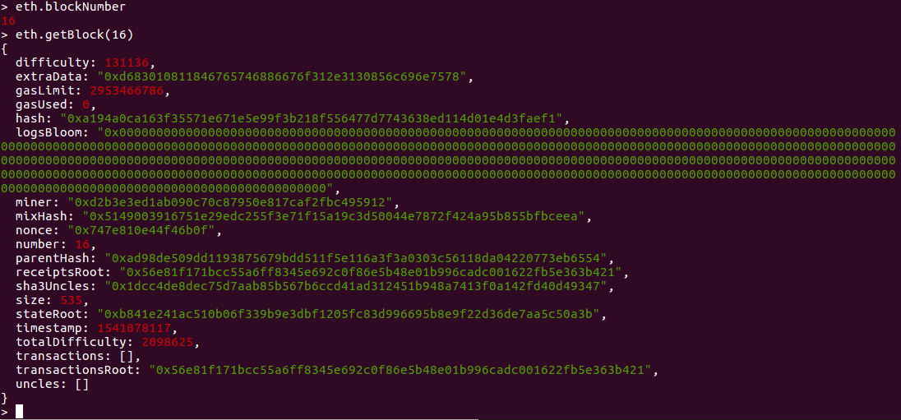

   分析：

   * 当前区块数量为*16*，使用`eth.getBlock(16)`获取当前最新块的信息。
   * 字段`difficulty`阐述了该区块的挖矿难度。`extraData`表示矿工在挖出当前区块之后，在该块上注明的，由他个人定义的特殊信息。`gasLimit`与上文创世区块定义相同，也是最大限制`gas`使用量，同理`gasUsed`就是当前私有链上的已经使用的`gas`。
   * `hash`是当前区块的哈希值，用于唯一地标识当前区块与其余区块的不同性，保证区块链上交易、挖矿等行为的正常进行。`miner`记录挖出该区块的矿工账号，`mixHash`与·`nonce`都是用于唯一标识POW过程证明该区块有效性的随机数值。
   * `number`字段标明当前区块的下标值，`parentHash`是父区块的哈希值，`receiptsRoot`标识收据树的根哈希值，`sha3Uncles`标识当前区块的所有`uncles`区块的哈希值，关于`uncles`数组内部，存储所有与当前区块有`uncle`关系的区块下标(`uncle`关系：区块a和区块b有`uncle关系`，当且仅当区块a是区块b的父区块的同等分支区块)
   * `size`标明当前区块内部存储信息的大小，`stateRoot`是区块状态树的根哈希值，`timeStamp`是唯一标识本区块的时间戳信息，`totalDifficulty`是从创世区块到本区块的总体挖矿难度值。
   * `transactions`存储所有经过认证的交易信息的，最初被记录到的区块的下标值，我们可以根据该数组内部下标值访问到对应的区块，获取对应的交易信息。`transactionsRoot`是总体交易树的根哈希值。


### 四、对日志输出进行解释

1. 初始启动`geth`客户端的日志解释

   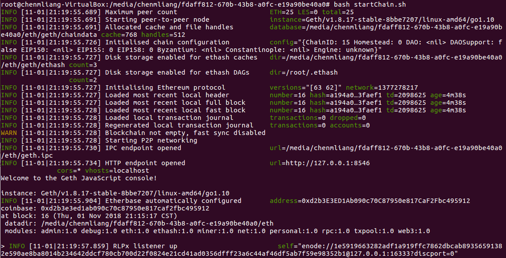

   分析：

   * 首先启动脚本进入客户端，此处采取启用私有节点的方式进入，所以日志其实会显示最大可接入节点数`ETH:25`,标明25个以太坊节点数接入是最大限度。接着启动`peer-to-peer`服务，然后为私有链上的区块更新申请空间，新空间的路径往往就是你所指定的`datadir`，内部专用于存储链数据的文件夹。
   * 初始化私有链上的设置参数，然后重点在于`ethash`文件夹的存储路径设置，因为`ethash`文件夹专用于存储在挖矿过程中计算难题的临时数据的存放，生成的文件十分的大(一般一个为1GB，空间不足时会自动增长)，记录该临时文件的存储路径，每当挖矿完成之后，便可以删除该临时文件，释放磁盘空间。
   * 然后就是对以太网协议的初始化，本地私有链的区块信息加载，交易信息加载。如果私有链为空的话系统还会自动帮你做`fast sync`快速同步，貌似是与公有链或其他链上的数据同步，私有链不为空的话就禁止同步发生。
   * 最后就是开启各种服务，`P2P`， `IPC`，`HTTP`协议的端口开放，以及以太Base的配置，之后就可以正常地使用`geth`进行各种操作了。


2. 挖矿过程的日志解释

   
    挖矿起始日志：

   * 首先更新挖矿线程，此处新建的挖矿线程数量为1。设定交易池的最大交易数目上限，此处为1000000000以太币。


   * 提交新的挖矿工作，右边栏`number`记录了当前所在的最新块下标，`sealhash`表示下一目标区块的认证哈希值，`uncles`代表当前与当前节点有`uncle`关系的所有节点的数量，`txs`记录在本区块上的交易数量，`gas`标明当前区块所使用的`gas`数目，`elapsed`如其名是实施当前操作的所消耗时间
   * 下面是挖矿过程的`Generating`工作，实际上是对新区块生成的初始准备工作，右边的`epoch`是当前状态的表示，当`epoch`为0时，标明正在准备状态，此时不会出现挖矿成功，反之则为1或更高层数，当前可以出现很多挖矿成功提示，当进度达到100时。`percentage`是当前状态的进度，一般情况下当`epoch`为0，`percentage`需要到100才能有挖矿成功成果产生。

   

   挖矿收获日志：

   * 出现`Successfully sealed new block`标志，即为挖矿成功，新区块被成功地解密，右边的`number`为当前区块，`sealhash`为被挖出的区块的认证哈希值。
   * `mined potiential block`执行挖矿过程，`Commit`之后当前区块自动更新为下一区块，同样的右边侧信息相应更新。


### 五、编写简单智能合约，部署到私有链上

1. 在`Remix`在线浏览器IDE上编写简单的基础智能合约，使用在线编译器进行编译结果生成，然后通过`Run`选项内的`Web3 Provider`与本地私有链进行连接。注意，与私有链连接时需要设置HTTP地址，链接地址就是上文中启动`geth`客户端使用的`rpc`端口号。

   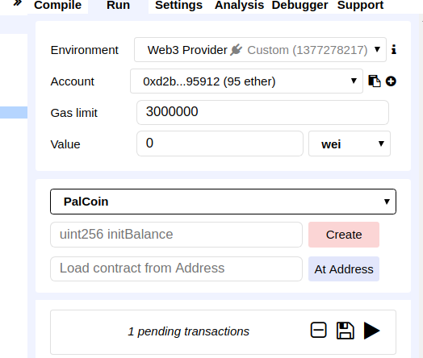

   ​

2. 此处编写的`Solidity`代码实现简单的转账功能，源码如下：

   ```
   pragma solidity ^0.4.0;

   contract PalCoin{

       mapping (address => uint256) public balanceStore;

       function say() public pure returns (string) {
           return "Welcome to PalCoin !";
       }

       function PalCoin(uint256 initBalance) public {
           // Init the balance of sender
           balanceStore[msg.sender] = initBalance;
       }

       function Transaction(address dest, uint256 amount) public {
           // Check if sender has enough money
           require(balanceStore[msg.sender] >= amount);
           // Check receiver overflow or not
           require(balanceStore[dest] + amount >= balanceStore[dest]);
           // Do Transaction
           balanceStore[msg.sender] -= amount;
           balanceStore[dest] += amount;
       }

   }
   ```

   使用该源码进行编译，部署到私有链上，再由`Remix`发起测试的交易请求，按下`Create`按钮，成功部署之后如下图：

   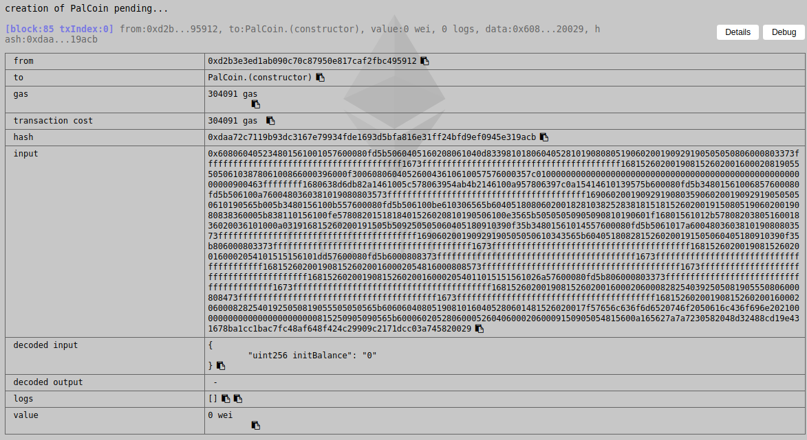

   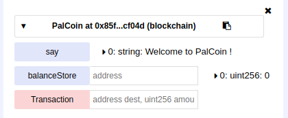

   ​

   分别按下`say`, `balanceStore`, `Transaction`函数调用，经过私有链上区块的数量增长，我们可以得到智能合约函数调用的应答，所得结果如下：

   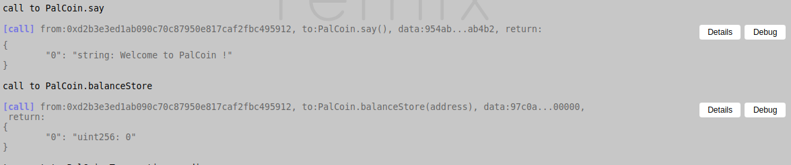

   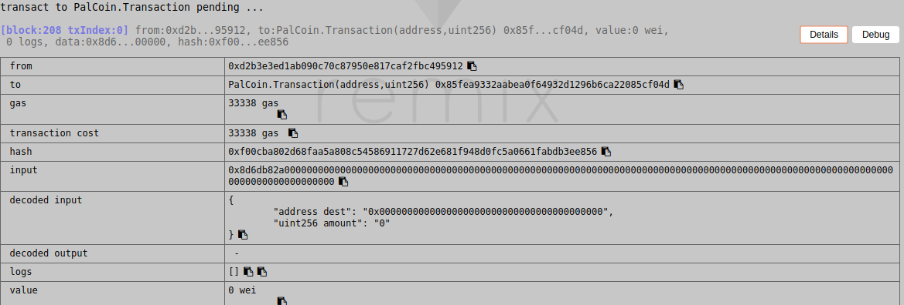

   相应的挖矿认证交易信息过程：(最后将所有的交易请求都pend上去了，剩余待处理交易为空)

   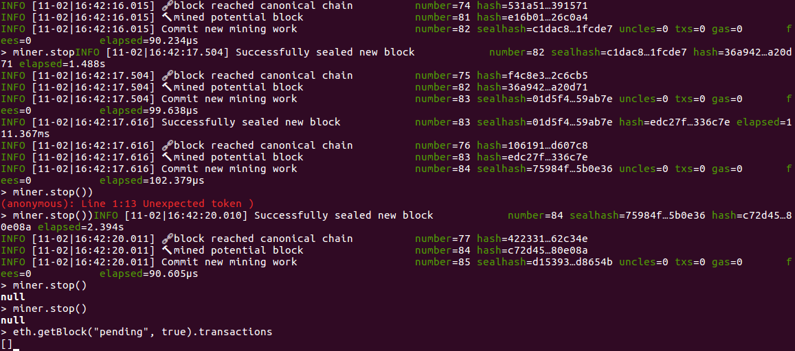


### 六、对交易字段进行解释

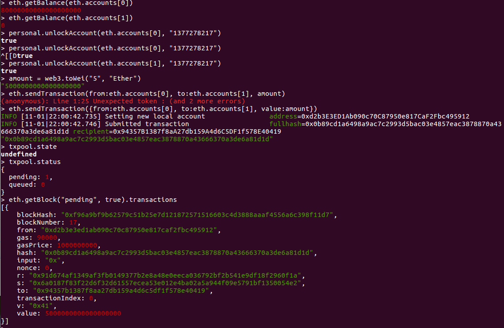

* 此处首先查看0号矿工的账户余额，当前为80以太币，然后转账给1号矿工，此时产生一个还没有获得认证的交易信息，即等待`pending`的交易。
* 查看当前`txpool`内部的状态，列出相关交易的字段。此处的`blockHash`为交易区块的哈希值，用来唯一标识它自身，`blockNumber`为下一区块的区块号，也是该交易应该记录在的区块号。`gas`是该交易消耗的`gas`值。`gasPrice`是交易发送者愿意支付的gas费用的价格。
* `hash`是本次交易的哈希值，`input`是外部产生交易时的输入字段，`nonce`是用来确立每笔交易只被执行一次的计数器，`r`、`s`、`v`都是签名数据的哈希值，`to`是目标矿工账户号，`transactionIndex`是本次交易的下标值，每次处理完一次交易，自动递增下一交易的下标，`value`就是本次交易的金额，采用最小单位`Wei`进行记录。

