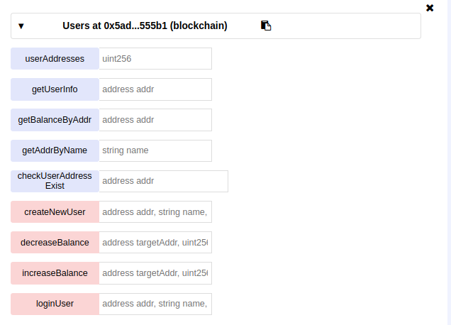
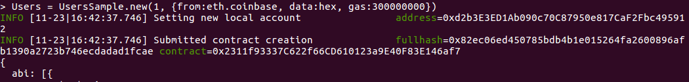
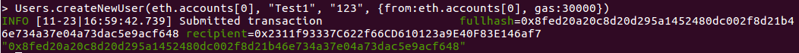
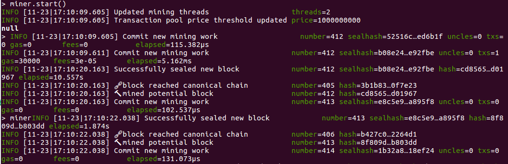
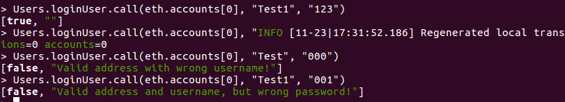
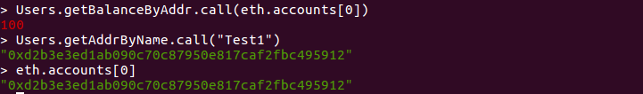
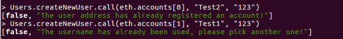
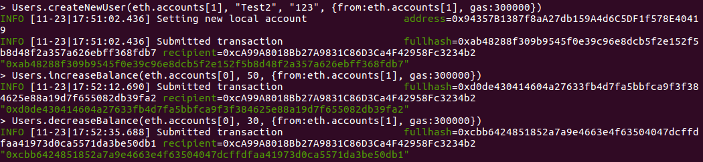
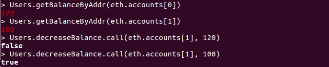

## 区块链Project -- 合约部署报告

### 姓名：陈明亮

### 学号：16340023

### 一、智能合约内容简述
* 本次区块链项目设计主题`Ether-Idle`，即一个基于以太坊的，支持多用户注册登录，以及在线交易各自闲置物品，以智能合约发行的代币为交易媒介的小型交易所。

* 落实到编程实际，将合约逻辑分为三层：交易总控层EI，用户注册登录逻辑层Users，商品买卖层Goods。分别进行每一层代码逻辑编写，分别进行测试。

* 合约代码内容简述：
	1. EI作为控制层，实际上结合了其余两部分的代码逻辑，结合前端的请求做出与用户存储，商品存储之间的数据交互，具体信息传输。
	2. Users作为用户层，主要用于处理用户信息的存储，同时也包含增加、 删除、 查找相关用户的逻辑。
	3. Goods作为商品层，用于接收用户上传具体商品信息，更新相关内容并在交易达成时删除对应商品。


### 二、合约部署截图
### 1. 用户逻辑层智能合约`Users`部署报告
* 首先登录`Remix`在线网页IDE，进行代码逻辑的编写。完成代码部分，启动编译，获取合约`Users`相关的`ABI`信息，连接对应本地终端启动的`geth`端口，并进行合约到私有链上的部署。





* 上图为合约初始`transaction`被认证处理之后，合约成功部署到私链上的截图信息。为了更好地查看合约各项函数运行结果，此处将部署之后的合约在本地`geth`客户端创建实例进行测试，创建实例命令如下：

  ```shell
  > abi = [The contract abi in Remix]
  > sample = eth.contract(abi)
  > TheSample = sample.at([The address of contract on Remix])
  ```


* 执行上述命令完毕之后(记得相关参数一定要按照实际情况填写)，我们就可以获得一个合约实例，并根据该实例进行相关的函数操作。

  

  当合约创建请求提交之后，本地须运行`miner.start()`启动挖矿，使得合约创建提交成功。

  ​

* 下面开始合约`Users`各项函数的部署测试，以及相关函数的调用结果的分析，源码解释。

  1. 测试各项合约`User`函数，并进行函数输出进行测试结果分析。

     * 第一步：结合上文创建的合约实例，执行函数`createNewUser()`，输入相关参数。

       

       ​

     * 第二步：执行挖矿操作，将提交的`transaction`添加到私有链上进行确认。

       

       ​

     * 第三步：执行函数`checkUserAddressExist()`进行基本的注册用户地址检测，查看其是否注册成功了。

       

       ​

     * 第四步：可以看到用户地址注册成功，我们下一步进行用户信息获取`getUserInfo()`。

       

       ​

     * 第五步：可以看到用户信息正确，下一步进行登录功能`loginUser()`验证。 

       			

       此处登录功能验证分别执行：正确用户名密码，错误用户名，错误密码情况。可以看到结果返回登录成功失败值正确，相关错误提示信息准确。

       ​

     * 第六步：执行用户名获取用户相关地址函数`getAddressByName()`，以及初始用户账户余额获取`getBalanceByAddr()`

       

       可以看到每个新注册的用户账户都会有`100 EI-coins`，查看相关用户名对应地址信息，结果正确。

       ​

     * 第七步：进行用户注册查重检验

       

       ​

     * 第八步：进行用户之间转账基本操作，判断转账合法性，以及账户余额的变化正确与否

       

       首先进行新用户`Test2`的创建，测试给用户`Test1`增加余额50，然后给用户`Test1`减少余额30。

       

       可以看到用户1的余额变为120，符合`100 + 50 - 30`，然后对用户2进行非法扣余额操作(超过范围)，发现正确输出`false`，符合条件则输出`true`

       ​

     * 结合上文测试结果，可得测试完毕，用户层合约`Users`运行逻辑正确。

       ​

  2. 合约`Users`各项函数源码逻辑分析

     - 用户信息存储结构体

       ```c++
       // User schema
       struct User{
           address userAddress;
           string username;
           string password;
           uint timestamp;
           uint index;
           uint balance;
       }

       // User address 
       struct UserAddress{
           address userAddress;
           uint index;
       }
       ```

       解释：结构体`User`声明存储用户所在地址值，以及用户名、密码、账户余额、创建时间等基本信息，此外还有	用户创建时拿到的下标ID。结构体`UserAddress`建立用户地址与用户下标之间的映射，使得外部输入用户名时能够通过获取用户ID，唯一地映射到用户地址。

        ​

     - 合约基本内部私有变量

       ```c++
       address[] public userAddresses; // All the users' addresses
       string[] private userNames;  // All the users' names
       mapping(address => User) private userList; // User list mapping with its address
       mapping(string => UserAddress) private userAddrs; // User address mapping with its username
       ```

       解释：通过存储对应的用户地址，用户名称数组，达到已注册用户信息存储。然后通过`mapping`创建，实现从地址访问相关用户结构`userList`，以及根据用户名访问用户地址，从而达到获取用户信息的结构`userAddrs`，此设计实际上具有对输入参数类型的弹性，可以根据不同输入迅速查询处理输出相关信息。

       ​

     - `createNewUser`函数源码：

       ```c++
       // Create a new user
       function createNewUser(address addr, string name, string password) public returns (bool result, string errMess){
       // Check address and username duplication
       if(checkUserAddressExist(addr)){
       	return (false, "The user address has already registered an account!");
       }else if(checkUserNameDuplicate(name)){
       	return (false, "The username has already been used, please pick another one!");
       }
       // Remember to store new user into userList, also create entity in userAddrs
       userAddresses.push(addr);
       userNames.push(name);

       userList[addr] = User(addr, name, password, now, userAddresses.length - 1, 100);
       userAddrs[name] = UserAddress(addr, userNames.length - 1);
       return (true, "");
       }
       ```

       函数解释：该函数负责创建新用户，支持对用户注册地址查重，用户注册名称查重，分别调用的是合约内部的私有函数进行检测，符合条件即返回相关错误信息。若注册成功，则往合约内部的存储结构新增用户信息。

       ​

     - ​
