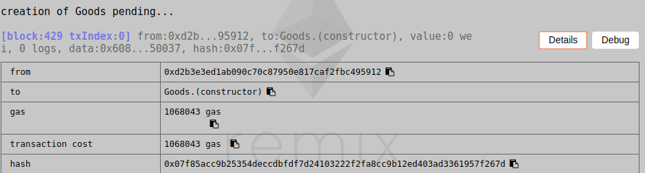
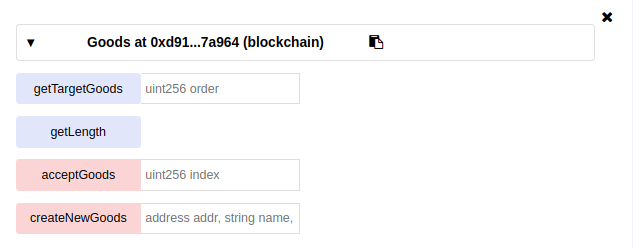
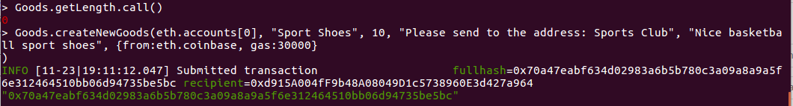
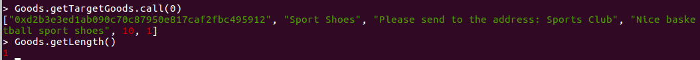
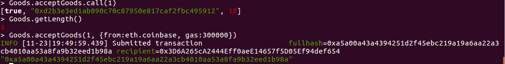
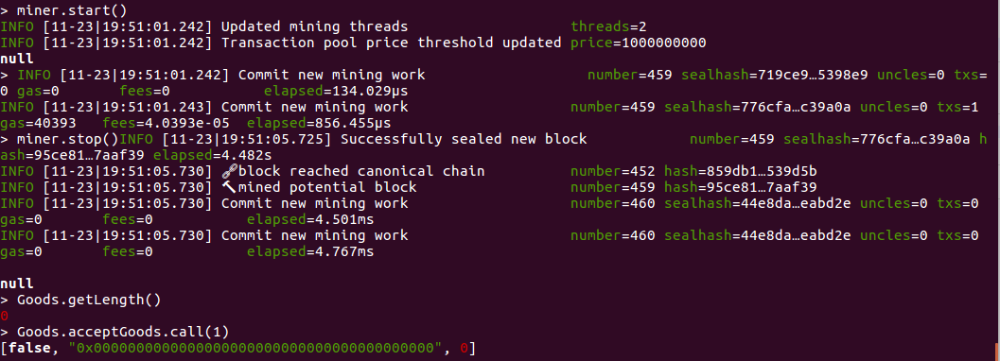

## 区块链Project -- 合约部署报告

### 姓名：陈明亮

### 学号：16340023

### 一、智能合约内容简述
* 本次区块链项目设计主题`Ether-Idle`，即一个基于以太坊的，支持多用户注册登录，以及在线交易各自闲置物品，以智能合约发行的代币为交易媒介的小型交易所。

* 落实到编程实际，将合约逻辑分为三层：交易总控层EI，用户注册登录逻辑层Users，商品买卖层Goods。分别进行每一层代码逻辑编写，分别进行测试。

* 合约代码内容简述：
	1. EI作为控制层，实际上结合了其余两部分的代码逻辑，结合前端的请求做出与用户存储，商品存储之间的数据交互，具体信息传输。
	2. Users作为用户层，主要用于处理用户信息的存储，同时也包含增加、 删除、 查找相关用户的逻辑。
	3. Goods作为商品层，用于接收用户上传具体商品信息，更新相关内容并在交易达成时删除对应商品。


### 二、合约部署截图与接口解释
### 1. 用户逻辑层智能合约`Users`部署报告
* 首先登录`Remix`在线网页IDE，进行代码逻辑的编写。完成代码部分，启动编译，获取合约`Users`相关的`ABI`信息，连接对应本地终端启动的`geth`端口，并进行合约到私有链上的部署。


* 上图为合约初始`transaction`被认证处理之后，合约成功部署到私链上的截图信息。为了更好地查看合约各项函数运行结果，此处将部署之后的合约在本地`geth`客户端创建实例进行测试，创建实例命令如下：

  ```shell
  > abi = [The contract abi in Remix]
  > sample = eth.contract(abi)
  > TheSample = sample.at([The address of contract on Remix])
  ```


* 执行上述命令完毕之后(记得相关参数一定要按照实际情况填写)，我们就可以获得一个合约实例，并根据该实例进行相关的函数操作。

  

  当合约创建请求提交之后，本地须运行`miner.start()`启动挖矿，使得合约创建提交成功。

  ​

* 下面开始合约`Users`各项函数的部署测试，以及相关函数的调用结果的分析，源码解释。

  1. 测试各项合约`User`函数，并进行函数输出进行测试结果分析。

     * 第一步：结合上文创建的合约实例，执行函数`createNewUser()`，输入相关参数。

       

       ​

     * 第二步：执行挖矿操作，将提交的`transaction`添加到私有链上进行确认。

       

       ​

     * 第三步：执行函数`checkUserAddressExist()`进行基本的注册用户地址检测，查看其是否注册成功了。

       

       ​

     * 第四步：可以看到用户地址注册成功，我们下一步进行用户信息获取`getUserInfo()`。

       

       ​

     * 第五步：可以看到用户信息正确，下一步进行登录功能`loginUser()`验证。 

       			

       此处登录功能验证分别执行：正确用户名密码，错误用户名，错误密码情况。可以看到结果返回登录成功失败值正确，相关错误提示信息准确。

       ​

     * 第六步：执行用户名获取用户相关地址函数`getAddressByName()`，以及初始用户账户余额获取`getBalanceByAddr()`

       

       可以看到每个新注册的用户账户都会有`100 EI-coins`，查看相关用户名对应地址信息，结果正确。

       ​

     * 第七步：进行用户注册查重检验

       

       ​

     * 第八步：进行用户之间转账基本操作，判断转账合法性，以及账户余额的变化正确与否

       

       首先进行新用户`Test2`的创建，测试给用户`Test1`增加余额50，然后给用户`Test1`减少余额30。

       

       可以看到用户1的余额变为120，符合`100 + 50 - 30`，然后对用户2进行非法扣余额操作(超过范围)，发现正确输出`false`，符合条件则输出`true`

       ​

     * 结合上文测试结果，可得测试完毕，用户层合约`Users`运行逻辑正确。

       ​

  2. 合约`Users`各项函数源码逻辑分析

     - 用户信息存储结构体

       ```c++
       // User schema
       struct User{
           address userAddress;
           string username;
           string password;
           uint timestamp;
           uint index;
           uint balance;
       }

       // User address 
       struct UserAddress{
           address userAddress;
           uint index;
       }
       ```

       解释：结构体`User`声明存储用户所在地址值，以及用户名、密码、账户余额、创建时间等基本信息，此外还有	用户创建时拿到的下标ID。结构体`UserAddress`建立用户地址与用户下标之间的映射，使得外部输入用户名时能够通过获取用户ID，唯一地映射到用户地址。

        ​

     - 合约基本内部私有变量

       ```c++
       address[] public userAddresses; // All the users' addresses
       string[] private userNames;  // All the users' names
       mapping(address => User) private userList; // User list mapping with its address
       mapping(string => UserAddress) private userAddrs; // User address mapping with its username
       ```

       解释：通过存储对应的用户地址，用户名称数组，达到已注册用户信息存储。然后通过`mapping`创建，实现从地址访问相关用户结构`userList`，以及根据用户名访问用户地址，从而达到获取用户信息的结构`userAddrs`，此设计实际上具有对输入参数类型的弹性，可以根据不同输入迅速查询处理输出相关信息。

       ​

     - `createNewUser`函数源码：

       ```c++
       // Create a new user
       function createNewUser(address addr, string name, string password) public returns (bool result, string errMess){
       // Check address and username duplication
       if(checkUserAddressExist(addr)){
       	return (false, "The user address has already registered an account!");
       }else if(checkUserNameDuplicate(name)){
       	return (false, "The username has already been used, please pick another one!");
       }
       // Remember to store new user into userList, also create entity in userAddrs
       userAddresses.push(addr);
       userNames.push(name);

       userList[addr] = User(addr, name, password, now, userAddresses.length - 1, 100);
       userAddrs[name] = UserAddress(addr, userNames.length - 1);
       return (true, "");
       }
       ```

       函数解释：该函数负责创建新用户，支持对用户注册地址查重，用户注册名称查重，分别调用的是合约内部的私有函数`checkUserAddressExist`和`checkUserNameDuplicate`进行查重检测，符合条件即返回相关错误信息。若注册成功，则往合约内部的存储结构新增用户信息。

       ​

     - 用户注册地址与名称查重函数

       ```c++
       // User address existion check
       function checkUserAddressExist(address addr) public constant returns (bool isExist){
           if(userAddresses.length == 0) return false;
           uint targetUserIndex = userList[addr].index;
           // Check target user's index pointing address equal to input or not
           return (userAddresses[targetUserIndex] == addr);
       }

       // User name duplication check
       function checkUserNameDuplicate(string name) private constant returns (bool isDuplicate){
           if(userNames.length == 0) return false;
           uint targetUserIndex = userAddrs[name].index;
           // Check target user's index pointing username equal to input or not
           return (keccak256(userNames[targetUserIndex]) == keccak256(name));
       }
       ```

       函数解释：通过基本的数组内部元素查重，同时考虑到性能问题与`gas`消耗量不要过大，通过`index`访问对应结构体数组内部的元素，达到时间复杂度为`O(1)`的地址、名称查重检测。

       ​

     - 用户登录合法性函数

       ```c++
       // Check user's address, username and password
       function loginUser(address addr, string name, string password) public returns (bool result, string errMess){
           if(!checkUserAddressExist(addr)){
           	return (false, "User address not exist!");
           }
           require(checkUserAddressExist(addr));
           User storage targetUser = userList[addr];
           if(keccak256(targetUser.username) != keccak256(name)){
           	return (false, "Valid address with wrong username!");
           }else if(keccak256(targetUser.password) != keccak256(password)){
           	return (false, "Valid address and username, but wrong password!");
           }
           return (true, "");
       }
       ```

       函数解释：进行基本的用户存储信息，与输入数据进行用户名、密码、地址的匹配，分别输出合法与否，以及相应的错误信息。

       ​

     - 获取用户基本相关信息

       ```c++
       // Get target user's info
       function getUserInfo(address addr) public constant returns (bool result, string username, uint userTime, uint userIndex){
           if(!checkUserAddressExist(addr)){
           	return (false, "", 0, 0);
           }
           return (
          		true,
           	userList[addr].username,
           	userList[addr].timestamp,
           	userList[addr].index
           );
       }
       ```

       函数解释：通过用户相关注册地址，返回相应的基本信息，包括用户注册时间，以及用户对应的ID。

       ​

     - 操作用户账户余额，获取余额信息等函数

       ```c++
       // Check user balance
       function getBalanceByAddr(address addr) public constant returns (uint balance){
       	return userList[addr].balance;
       }

       // Increase user balance
       function increaseBalance(address targetAddr, uint count) public payable returns (bool result){
       	if(userList[targetAddr].balance + count <= count){
       		return false;
       	}
       	userList[targetAddr].balance += count;
       	return true;
       }

       // Decrease user balance
       function decreaseBalance(address targetAddr, uint count) public payable returns (bool result){
       	if(userList[targetAddr].balance < count){
       		return false;
       	}
       	userList[targetAddr].balance -= count;
       	return true;
       }
       ```

       函数解释：进行用户账户余额的增减查操作，同时对非法减，非法加(溢出)操作进行检测，返回相关错误信息。


### 2. 商品逻辑层智能合约`Goods`部署报告

* 同样先在`Remix`上进行编译，然后连接本地私有链，进行`Goods`合约的部署。

  

  


* 对商品层合约各项函数进行测试，确认分析测试结果的正确性。

  第一步：首先确认初始商品是否为空，然后进行第一次上传商品信息。

  

  第二步：执行挖矿，将上传商品信息的`transaction`添加到私有链主链上，确认当前商品数量，获取上传成功的商品信息。

  

  第三步：向对应商品发出购买请求，执行`accpetGoods()`函数，检测基本的商品购买后是否下架。

  

  

  分析：购买请求被确认之后，当前商品数量变为0，尝试使用`call`函数去检测是否还能购买商品，返回失败信息。

  第四步：检测用户是否能够创建同名商品

  

  分析：当前处在货架上的商品，相应用户不能同时创建两个同名的，但是不同用户则可以创建同名商品。

  ​

* 合约`Goods`各项函数源码分析

  * 结构体`Good`(此处为单一商品意义)

    ```c++
    struct Good{
    	address sellerAddr;  // Seller's address
    	string name;  // Goods name
    	string realTranscatInfos;  // The informations about offline transcations to send goods 																			to buyer
    	string description;  // Goods information
    	uint price;  // Price of goods, take EI coin as unit
    	uint time;
    	uint index;
    }
    ```

    分析：商品信息存储相应的卖家对应的内部地址，以及商品名，商品交易附带现实信息，商品描述，商品价格等等主要信息，当然也包含时间戳与下标，利于访问对应商品，获取信息。

    ​

  * 函数`createNewGoods`分析

    ```c++
    // Seller update goods
    function createNewGoods(address addr, string name, uint price, string realInfos, string descri) public payable returns (bool result, string mess){
    	// check seller has ever create same name goods infos or not
    	for(uint i=0; i<goodIndexes.length; ++i){
    	Good storage temp = goodLists[goodIndexes[i]];
    	if(temp.sellerAddr == addr && keccak256(temp.name) == keccak256(name)){
    		return (false, "Create target good failed! You have already created another goods 							with the same name!");
    	}
    }

    	// New goods info
    	uint len = goodIndexes.length;
    	length += 1;
    	goodIndexes.push(len+1);
    	goodLists[len+1] = Good(addr, name, realInfos, descri, price, now, len+1);
    	return (true, "");
    }
    ```

    分析：该函数主要用于增添货架上的新商品，首先检测发送方的地址，检测其是否发送过重复名称的商品，若是则返回重复警告，否则增添对应卖家的新商品至内部存储。

    ​

  * 函数`acceptGoods`分析

    ```c++
    // Buyer buy goods
    function acceptGoods(uint index) public payable returns (bool result, address addr, uint price){
        for(uint i=0; i<goodIndexes.length; i++){
        if(goodIndexes[i] ==  index){
            address add = goodLists[index].sellerAddr;
            uint pri = goodLists[index].price;
            delete goodIndexes[i];
            delete goodLists[index];
            length -= 1;
            return (true, add, pri);
        	}
        }
       	return (false, address(0), 0);
    }
    ```

    分析：本函数用于买家购买相关商品，更新内部商品信息所用。可以看到函数内部分别将对应商品从数组中删除，并且将当前货架商品数量减一。非法购买商品则会报错，返回相应空地址，反之成功购买返回卖家地址，以及商品价格。


### 3. 总体控制层智能合约`EI`部署报告

* 控制层代码负责本项目的前后端对接，同时限制前端用户对后台逻辑层的函数滥用，限制规范用户使用行为，同时调用逻辑层函数达到功能，保证各项功能的正确执行。

* `Remix`上编译，部署到私有链上

  

  


* 控制层各项函数测试结果与逻辑层大体相似，考虑到篇幅此处不放上来，总体来说就是对逻辑层各项函数返回值的转让返回。


* 控制层各项函数解释

  * 用户注册登录信息传输给`Users`，并接受相关信息返回

    ```c++
    // 1. Basic user signin, signup methods
    function registerUser(address addr, string username, string password) public returns (bool result, string errMess){
            return userStorage.createNewUser(addr, username, password);
    }

    function siginUser(address addr, string username, string password) public returns (bool result, string errMess){
            return userStorage.loginUser(addr, username, password);
    }
    ```

    ​

  * 内部交易私有函数`transaction`

    ```c++
    // 2. User exchanges balance methods
    function transcation(address srcAddress, address dstAddress, uint coinNum) private returns (bool result, string errMess){
            uint srcBalance = userStorage.getBalanceByAddr(srcAddress);
            // check source user balance enough ot not
            if(srcBalance < coinNum){
                return (false, "Buyer does not have enough EI coins!");
            }
            if(userStorage.decreaseBalance(srcAddress, coinNum) && userStorage.increaseBalance(dstAddress, coinNum)){
                return (true, "");
            }else {
                return (false, "Error occurs when changing user balances!");
            }
    }
    ```

    分析：内部交易函数不可公开，只能在用户买卖商品成功时执行，判断买家是否有足够多EI币，执行相应的转账操作。

    ​

  * 上传商品，购买商品接口实现

    ```c++
    // 3. User update goods infos, or accept goods infos
    function updateGoodsInfo(string goodName, uint goodPrice, string realInfos, string description) public returns (bool result, string errMess){
            // First step: check sender address valid
            if(!userStorage.checkUserAddressExist(msg.sender)){
                return (false, "Unregisted address, invalid updation of goods!");
            }
            // Sceond step: put new goods
            return goodStorage.createNewGoods(msg.sender, goodName, goodPrice, realInfos, description);
        }

    function acceptTargetGood(uint goodID) public returns (bool result, string errMess){
            // First step: check sender address valid
            if(!userStorage.checkUserAddressExist(msg.sender)){
                return (false, "Unregisted address, invalid updation of goods!");
            }
            // Second step: do transaction
            bool res;
            address dstAddr;
            uint price;
            (res, dstAddr, price) = goodStorage.acceptGoods(goodID);
            if(!res){
                return (res, "Buy goods failed!");
            }
            // Fourth step: append EI_Transact
            return transcation(msg.sender, dstAddr, price);
    }
    ```

    分析：控制层主要增加了基本的地址合法性安段，以及将相关数据传输给逻辑层，等待逻辑层返回值并传输给前端。