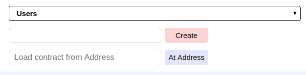
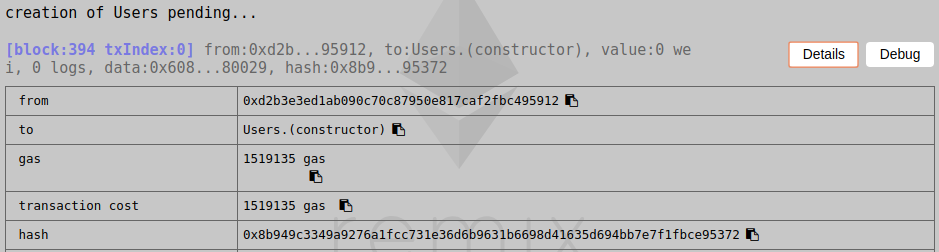

## 区块链Project -- 合约部署报告

### 姓名：陈明亮

### 学号：16340023

### 一、智能合约内容简述
* 本次区块链项目设计主题`Ether-Idle`，即一个基于以太坊的，支持多用户注册登录，以及在线交易各自闲置物品，以智能合约发行的代币为交易媒介的小型交易所。

* 落实到编程实际，将合约逻辑分为三层：交易总控层EI，用户注册登录逻辑层Users，商品买卖层Goods。分别进行每一层代码逻辑编写，分别进行测试。

* 合约代码内容简述：
	1. EI作为控制层，实际上结合了其余两部分的代码逻辑，结合前端的请求做出与用户存储，商品存储之间的数据交互，具体信息传输。
	2. Users作为用户层，主要用于处理用户信息的存储，同时也包含增加、 删除、 查找相关用户的逻辑。
	3. Goods作为商品层，用于接收用户上传具体商品信息，更新相关内容并在交易达成时删除对应商品。

### 二、合约部署截图
1. 用户逻辑层智能合约`Users`部署
* 首先登录`Remix`在线网页IDE，进行代码逻辑的编写。完成代码部分，启动编译，获取合约`Users`相关的`ABI`信息，连接对应本地终端启动的`geth`端口，并进行合约到私有链上的部署。

* 上图为合约初始`transaction`被认证处理之后，合约成功部署到私链上的返回信息。下面开始合约函数的解释，以及相关函数的调用结果的测试。
	1. 